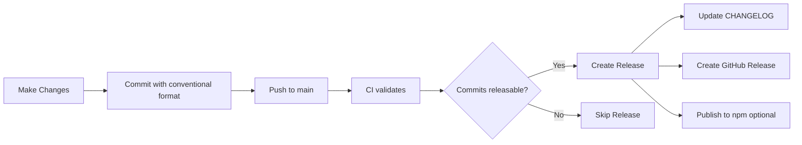

# Quick Release Guide

## TL;DR

1. Use conventional commits: `feat:`, `fix:`, `docs:`, etc.
2. Push to `main` branch
3. GitHub Actions automatically creates release

## Commit Message Format

```
<type>: <short description>

[optional longer description]

[optional BREAKING CHANGE: description]
```

## Common Commit Types

| Type | Bumps Version | Example |
|------|---------------|---------|
| `feat:` | Minor (0.1.0 -> 0.2.0) | `feat: add new MCP tool` |
| `fix:` | Patch (0.1.0 -> 0.1.1) | `fix: resolve memory leak` |
| `perf:` | Patch | `perf: optimize processing` |
| `docs:` | Patch | `docs: update README` |
| `refactor:` | Patch | `refactor: simplify logic` |
| `BREAKING CHANGE:` | Major (0.1.0 -> 1.0.0) | See below |

Types that don't trigger releases: `style`, `test`, `build`, `ci`, `chore`

## Breaking Changes

```bash
feat!: redesign API

BREAKING CHANGE: Changed function signature
```

## Enable NPM Publishing

1. Create npm token: https://www.npmjs.com/settings/tokens
2. Add to GitHub secrets as `NPM_TOKEN`
3. Update `.releaserc.json`: `"npmPublish": true`

## Testing Locally

```bash
# Preview what would be released
npm run semantic-release:dry
```

## Workflow



## Full Documentation

See [SEMANTIC_RELEASE.md](SEMANTIC_RELEASE.md) for complete documentation.
