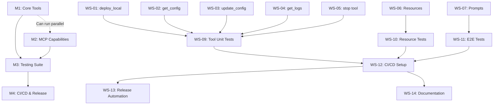

# OBI MCP Server - Workstream Plan

**Meta Orchestrator Plan for MVP v0.1.0**
**Created**: 2025-11-14
**Status**: Active

---

## 🎯 Milestone Overview

```
Meta Orchestrator
├── M1: Core Tools (WS-01, WS-02, WS-03, WS-04, WS-05) [PARALLEL]
├── M2: MCP Capabilities (WS-06, WS-07, WS-08) [PARALLEL with M1]
├── M3: Testing Suite (WS-09, WS-10, WS-11) [After M1]
└── M4: CI/CD & Release (WS-12, WS-13, WS-14) [After M3]
```

**Total Duration**: 2-3 weeks
**Parallel Capacity**: Up to 8 concurrent workstreams

---

## 📊 Dependency Graph



---

## 🚀 M1: Core Tools Implementation

**Goal**: Implement all 5 remaining P0 MCP tools
**Duration**: 1 week
**Parallel Execution**: All 5 can run simultaneously
**Dependencies**: None (foundation complete)

### WS-01: Implement `obi_deploy_local` Tool

**ID**: WS-01
**Agent**: backend-architect
**Priority**: P0
**Estimated Duration**: 1 day

**Deliverables**:
- [ ] Tool definition in `src/tools/deploy-local.ts`
- [ ] Input schema with Zod validation
- [ ] Tool handler wrapping `obiManager.deployLocal()`
- [ ] Error handling and user-friendly messages
- [ ] Tool registration in server

**Acceptance Criteria**:
- Tool listed via MCP protocol
- Accepts config or configPath
- Returns deployment status with PID
- Handles "already running" gracefully

**Files**:
- `src/tools/deploy-local.ts` (new)
- `src/tools/index.ts` (update exports)
- `src/server/index.ts` (register tool)

---

### WS-02: Implement `obi_get_config` Tool

**ID**: WS-02
**Agent**: backend-architect
**Priority**: P0
**Estimated Duration**: 0.5 day

**Deliverables**:
- [ ] Tool definition in `src/tools/get-config.ts`
- [ ] Input schema (no params needed)
- [ ] Tool handler wrapping `obiManager.getConfig()`
- [ ] YAML to JSON formatting
- [ ] Tool registration

**Acceptance Criteria**:
- Returns current config as JSON
- Handles "no config" state
- Pretty-printed output

**Files**:
- `src/tools/get-config.ts` (new)
- `src/tools/index.ts` (update)
- `src/server/index.ts` (register)

---

### WS-03: Implement `obi_update_config` Tool

**ID**: WS-03
**Agent**: backend-architect
**Priority**: P0
**Estimated Duration**: 1 day

**Deliverables**:
- [ ] Tool definition in `src/tools/update-config.ts`
- [ ] Input schema (config, merge, restart params)
- [ ] Tool handler wrapping `obiManager.updateConfig()`
- [ ] Config validation with Zod
- [ ] Merge vs replace logic
- [ ] Optional restart handling

**Acceptance Criteria**:
- Validates config schema
- Supports merge and replace modes
- Optionally restarts OBI
- Returns updated config

**Files**:
- `src/tools/update-config.ts` (new)
- `src/tools/index.ts` (update)
- `src/server/index.ts` (register)

---

### WS-04: Implement `obi_get_logs` Tool

**ID**: WS-04
**Agent**: backend-architect
**Priority**: P0
**Estimated Duration**: 0.5 day

**Deliverables**:
- [ ] Tool definition in `src/tools/get-logs.ts`
- [ ] Input schema (lines, level filter)
- [ ] Tool handler wrapping `obiManager.getLogs()`
- [ ] Log level filtering
- [ ] Formatted output

**Acceptance Criteria**:
- Returns last N log lines
- Supports level filtering
- Handles missing log file

**Files**:
- `src/tools/get-logs.ts` (new)
- `src/tools/index.ts` (update)
- `src/server/index.ts` (register)

---

### WS-05: Implement `obi_stop` Tool

**ID**: WS-05
**Agent**: backend-architect
**Priority**: P0
**Estimated Duration**: 0.5 day

**Deliverables**:
- [ ] Tool definition in `src/tools/stop.ts`
- [ ] Input schema (force param optional)
- [ ] Tool handler wrapping `obiManager.stop()`
- [ ] Graceful vs forced stop
- [ ] Verification of termination

**Acceptance Criteria**:
- Sends SIGTERM by default
- Optional force mode (SIGKILL)
- Verifies process stopped
- Handles "not running" state

**Files**:
- `src/tools/stop.ts` (new)
- `src/tools/index.ts` (update)
- `src/server/index.ts` (register)

---

## 🔌 M2: MCP Capabilities (Parallel with M1)

**Goal**: Add MCP resources and prompts
**Duration**: 1 week
**Parallel Execution**: All 3 can run simultaneously
**Dependencies**: None (uses existing manager methods)

### WS-06: Implement MCP Resources

**ID**: WS-06
**Agent**: backend-architect
**Priority**: P0
**Estimated Duration**: 1 day

**Deliverables**:
- [ ] Resource handler in `src/resources/index.ts`
- [ ] `obi://config/current` - Current config JSON
- [ ] `obi://status/health` - Process health metrics
- [ ] `obi://logs/recent` - Last 100 log lines
- [ ] Resource registration in server

**Acceptance Criteria**:
- Resources listed via MCP protocol
- Auto-refresh capability
- Cached with TTL (optional)

**Files**:
- `src/resources/index.ts` (new)
- `src/server/index.ts` (add resource handlers)

---

### WS-07: Implement MCP Prompts

**ID**: WS-07
**Agent**: ai-engineer
**Priority**: P0
**Estimated Duration**: 1 day

**Deliverables**:
- [ ] Prompt handler in `src/prompts/index.ts`
- [ ] `setup-obi-local` prompt template
- [ ] Interactive configuration guide
- [ ] Validation and troubleshooting steps
- [ ] Prompt registration

**Acceptance Criteria**:
- Prompt available via MCP
- Guides user through OBI setup
- Validates prerequisites
- Suggests fixes for common issues

**Files**:
- `src/prompts/index.ts` (new)
- `src/prompts/setup-local.ts` (new)
- `src/server/index.ts` (add prompt handlers)

---

### WS-08: Tool Handler Type Safety Improvements

**ID**: WS-08
**Agent**: backend-architect
**Priority**: P1
**Estimated Duration**: 0.5 day

**Deliverables**:
- [ ] Centralized tool handler type definitions
- [ ] Consistent error response format
- [ ] Shared validation utilities
- [ ] Type-safe tool registry

**Acceptance Criteria**:
- All tools use common types
- Type errors caught at compile time
- Consistent error formatting

**Files**:
- `src/types/mcp.ts` (enhance)
- `src/utils/tool-helpers.ts` (new)

---

## 🧪 M3: Testing Suite

**Goal**: Comprehensive test coverage (>80%)
**Duration**: 1 week
**Dependencies**: M1, M2 complete
**Parallel Execution**: After M1/M2, all 3 can run simultaneously

### WS-09: Unit Tests for All Tools

**ID**: WS-09
**Agent**: test-writer-fixer
**Priority**: P0
**Estimated Duration**: 2 days

**Deliverables**:
- [ ] Test suite for each tool in `tests/unit/tools/`
- [ ] Mock ObiManager for isolation
- [ ] Test input validation
- [ ] Test error handling
- [ ] Test output formatting
- [ ] Coverage >80%

**Acceptance Criteria**:
- All tools have unit tests
- Coverage meets threshold
- Tests pass in CI

**Files**:
- `tests/unit/tools/deploy-local.test.ts` (new)
- `tests/unit/tools/get-config.test.ts` (new)
- `tests/unit/tools/update-config.test.ts` (new)
- `tests/unit/tools/get-logs.test.ts` (new)
- `tests/unit/tools/stop.test.ts` (new)
- `tests/unit/tools/status.test.ts` (update)

---

### WS-10: Integration Tests

**ID**: WS-10
**Agent**: test-writer-fixer
**Priority**: P0
**Estimated Duration**: 2 days

**Deliverables**:
- [ ] Integration tests in `tests/integration/`
- [ ] Mock OBI process for testing
- [ ] Test full tool workflows
- [ ] Test resource access
- [ ] Test prompt execution

**Acceptance Criteria**:
- End-to-end tool execution tested
- MCP protocol interaction verified
- Resources accessible

**Files**:
- `tests/integration/server.test.ts` (new)
- `tests/integration/tools-workflow.test.ts` (new)
- `tests/integration/resources.test.ts` (new)

---

### WS-11: E2E Tests with Real OBI

**ID**: WS-11
**Agent**: test-writer-fixer
**Priority**: P1
**Estimated Duration**: 1 day

**Deliverables**:
- [ ] E2E tests in `tests/e2e/`
- [ ] Test with real OBI binary (when available)
- [ ] Smoke tests for critical paths
- [ ] CI configuration for E2E

**Acceptance Criteria**:
- Tests run against real OBI
- Critical workflows validated
- Can run in CI (optional, requires OBI)

**Files**:
- `tests/e2e/obi-lifecycle.test.ts` (new)
- `tests/e2e/config-management.test.ts` (new)

---

## 🔧 M4: CI/CD & Release

**Goal**: Automated testing, building, and releases
**Duration**: 3 days
**Dependencies**: M3 complete
**Parallel Execution**: WS-12 first, then WS-13 + WS-14 parallel

### WS-12: GitHub Actions CI/CD

**ID**: WS-12
**Agent**: devops-automator
**Priority**: P0
**Estimated Duration**: 1 day

**Deliverables**:
- [ ] CI workflow in `.github/workflows/ci.yml`
- [ ] Run tests on PR
- [ ] Run linting and type checking
- [ ] Build verification
- [ ] Coverage reporting
- [ ] Matrix testing (Node 18, 20, 22)

**Acceptance Criteria**:
- CI runs on every PR
- All checks must pass before merge
- Coverage visible in PR

**Files**:
- `.github/workflows/ci.yml` (new)
- `.github/workflows/test.yml` (new)

---

### WS-13: Release Automation

**ID**: WS-13
**Agent**: devops-automator
**Priority**: P0
**Estimated Duration**: 1 day

**Deliverables**:
- [ ] Release workflow in `.github/workflows/release.yml`
- [ ] Semantic versioning with tags
- [ ] Changelog generation
- [ ] npm package publishing
- [ ] GitHub release creation

**Acceptance Criteria**:
- Automated releases on version tags
- Changelog auto-generated
- npm package published

**Files**:
- `.github/workflows/release.yml` (new)
- `package.json` (update scripts)

---

### WS-14: Documentation Generation

**ID**: WS-14
**Agent**: technical-writer (or backend-architect)
**Priority**: P0
**Estimated Duration**: 1 day

**Deliverables**:
- [ ] API documentation from TSDoc
- [ ] Tool reference guide
- [ ] Update README with all tools
- [ ] Add architecture diagram
- [ ] Troubleshooting guide

**Acceptance Criteria**:
- All tools documented
- Examples provided
- Diagrams clear

**Files**:
- `docs/API.md` (update)
- `docs/ARCHITECTURE.md` (update)
- `README.md` (update)

---

## 📋 Quality Gates

### Before M3 (Testing)
- [ ] All 5 tools implemented and registered
- [ ] All resources accessible
- [ ] Prompts functional
- [ ] Manual testing successful

### Before M4 (CI/CD)
- [ ] Unit test coverage >80%
- [ ] Integration tests pass
- [ ] No critical bugs
- [ ] Code review complete

### Before v0.1.0 Release
- [ ] All CI checks green
- [ ] Documentation complete
- [ ] Changelog updated
- [ ] Version bumped to 0.1.0

---

## 🎯 Parallel Execution Strategy

### Phase 1 (Week 1): Foundation
**Concurrent Workstreams**: 8 parallel
```
[WS-01: deploy_local] [WS-02: get_config] [WS-03: update_config]
[WS-04: get_logs] [WS-05: stop] [WS-06: Resources]
[WS-07: Prompts] [WS-08: Type Safety]
```

### Phase 2 (Week 2): Testing
**Concurrent Workstreams**: 3 parallel (after Phase 1)
```
[WS-09: Unit Tests] [WS-10: Integration Tests] [WS-11: E2E Tests]
```

### Phase 3 (Week 2-3): CI/CD
**Concurrent Workstreams**: 2 parallel (after Phase 2)
```
[WS-12: GitHub Actions] → [WS-13: Release] + [WS-14: Docs]
```

---

## 🤖 Agent Assignment

| Workstream | Primary Agent | Backup Agent | Estimated Hours |
|------------|---------------|--------------|-----------------|
| WS-01 | backend-architect | rapid-prototyper | 8h |
| WS-02 | backend-architect | rapid-prototyper | 4h |
| WS-03 | backend-architect | rapid-prototyper | 8h |
| WS-04 | backend-architect | rapid-prototyper | 4h |
| WS-05 | backend-architect | rapid-prototyper | 4h |
| WS-06 | backend-architect | ai-engineer | 8h |
| WS-07 | ai-engineer | backend-architect | 8h |
| WS-08 | backend-architect | - | 4h |
| WS-09 | test-writer-fixer | - | 16h |
| WS-10 | test-writer-fixer | - | 16h |
| WS-11 | test-writer-fixer | api-tester | 8h |
| WS-12 | devops-automator | - | 8h |
| WS-13 | devops-automator | - | 8h |
| WS-14 | backend-architect | - | 8h |

**Total Estimated Hours**: 112h
**With 8 Parallel Agents**: ~14h wall-clock time (Week 1)
**With 3 Parallel Agents**: ~16h wall-clock time (Week 2)
**Sequential**: ~2h (Week 3)

**Overall Timeline**: 2-3 weeks

---

## 📞 Coordination Protocol

### Communication Channels
- **GitHub Issues**: One per workstream (WS-XX)
- **GitHub PRs**: One per workstream (`WS-XX: Description`)
- **GitHub Projects**: Kanban board for tracking
- **Daily Sync**: Meta orchestrator reviews progress

### Workflow
```bash
# Agent workflow (automated via Task tool)
1. Receive workstream assignment
2. Create branch: git checkout -b WS-XX-description
3. Implement per specification
4. Run quality checks: npm run typecheck && npm run lint && npm test
5. Create PR: gh pr create --title "WS-XX: Description"
6. Wait for CI and review
7. Merge: gh pr merge --squash
8. Report completion to meta orchestrator
```

### Conflict Resolution
- Merge conflicts: Defer to meta orchestrator
- Blocked dependencies: Escalate immediately
- Scope creep: Document as new workstream

---

## 🎉 Success Criteria

### v0.1.0 MVP Release
- [ ] All 14 workstreams completed
- [ ] All quality gates passed
- [ ] CI/CD fully automated
- [ ] Documentation complete
- [ ] Ready for community alpha testing

---

**Orchestrator**: Meta Orchestrator
**Status**: Ready for agent deployment
**Next Action**: Create GitHub issues and launch parallel agents
